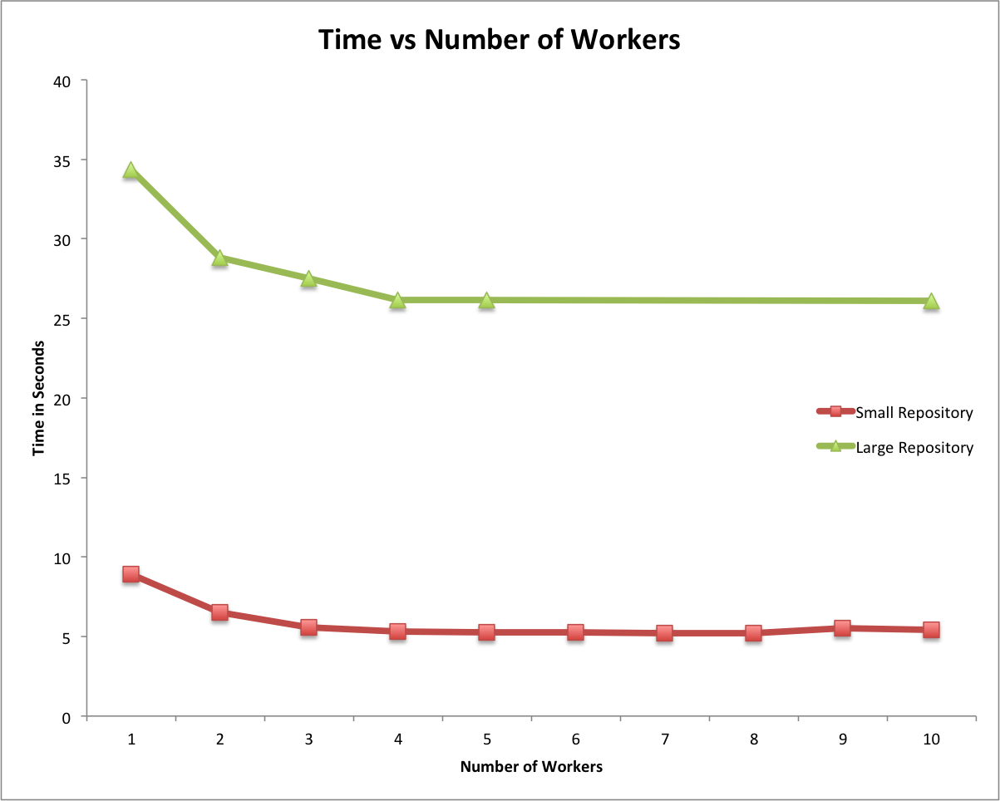

# cyclo

This programme is focussed on the efficient computation of code complexity for a given repository, utilising a set of nodes as appropriate to minimise execution time from submission to result return.

It has been developed using Cloud Haskell libraries as they are presented in a sample apllication from Stephen Barrett.  Code complexity is measured using the Argon Haskell cyclomatic complexity library.

### Requirements

Argon - https://github.com/rubik/argon

### Running

1. Clone and build this repositoy
2. run `stack-exec cyclo-exe worker <ip> <port>` to set up each worker, changing the port each time
3. run `stack-exec cyclo-exe master <ip> <port> <URL of test repo>`

### Report 
##### Details the design and comparative performance over a sample repository set ranging from the small to the large

The programme was run on both a small and larg repository using various numbers of workers with each. The number of workers was then plotted against time. 
At first, as expected, the time went down as the number of workers increased. However, this affect plateaued and the small repository actually took slightly longer to analyse with large numbers of workers.
This plateauing would be affected by the number of cores on the machine and the overhead involved in distributing the work.